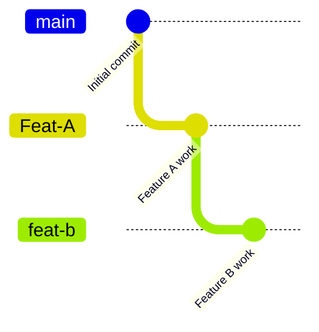
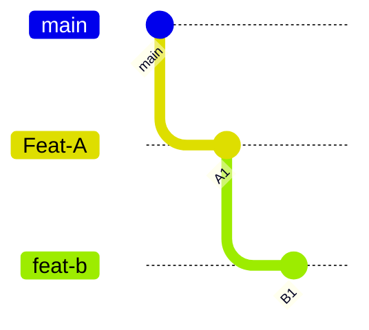
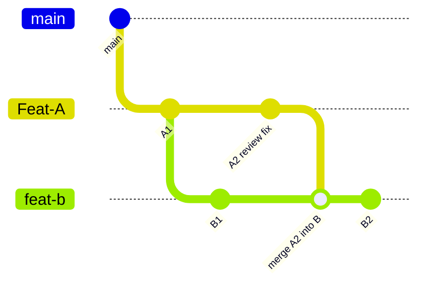
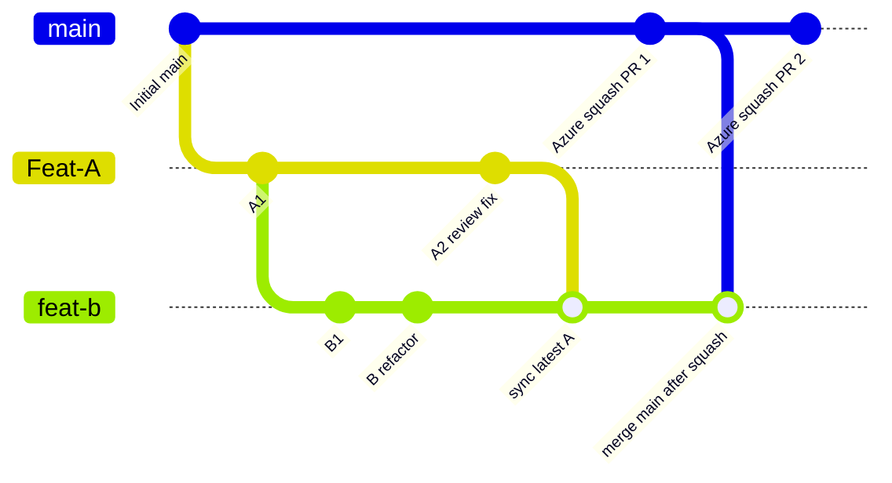
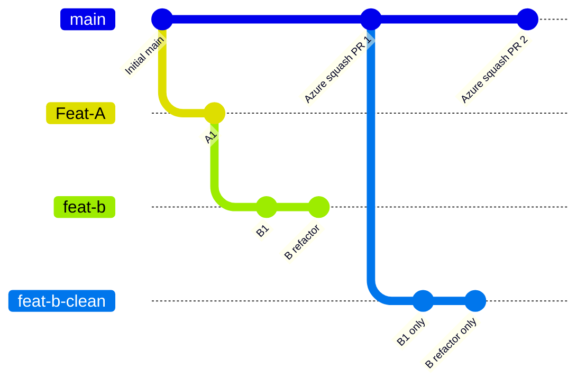
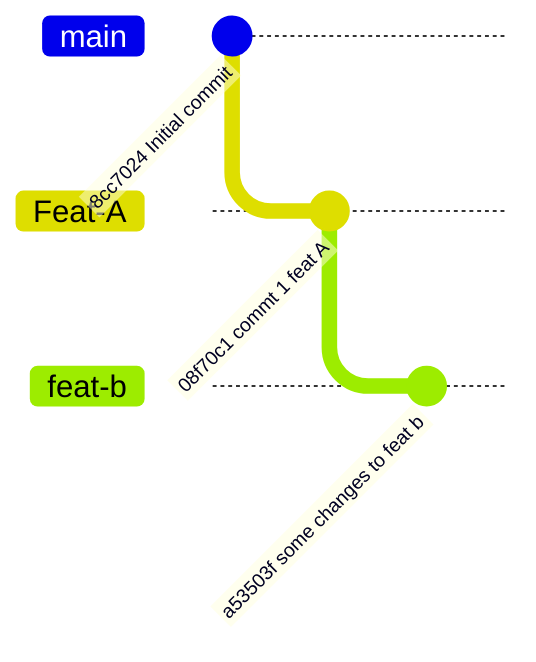

# Stacked feature branches with squash merges

This sandbox represents a common situation:

- `main` is the target branch.
- `Feat-A` is the first feature branch.
- `feat-b` depends on `Feat-A`.
- `Feat-A` will be merged first.
- `Feat-A` may continue receiving commits while `feat-b` already exists.
- The team uses squash commits when merging pull requests.
- Pull requests are completed remotely in Azure DevOps.
- Local merges are used only to keep `Feat-A` and `feat-b` up to date.
- Only one pull request targets `main` at a time.
- `feat-b` may contain large refactoring changes.

The desired branch shape is:



## Pull request setup while Feat-A is open

While feature A is still under review, only PR 1 targets `main`:

```text
PR 1: Feat-A => main       already targets main
PR 2: feat-b => Feat-A     does not target main yet
```

Complete these pull requests in Azure DevOps. Do not merge PR branches into
`main` locally.

Do not open or retarget `feat-b => main` while `Feat-A` is still unmerged. At
this stage, there should be only one PR into `main`: `Feat-A => main`.

If you open `feat-b => main` too early, the second PR will include both
`Feat-A` changes and `feat-b` changes, which makes review harder and hides the
real scope of feature B.

By targeting `feat-b` into `Feat-A`, the second PR shows only the changes that
belong to feature B.



```text
PR 1 compares Feat-A against main.
PR 2 compares feat-b against Feat-A, not main.
```

## Creating feat-b from Feat-A

Start from the latest `Feat-A`:

```bash
git checkout Feat-A
git pull origin Feat-A
git checkout -b feat-b
git push -u origin feat-b
```

Then open:

```text
feat-b => Feat-A
```

From this point, keep the active PRs in Azure DevOps, but do the branch sync
work locally and push the updated branch. Until PR 1 is complete, only PR 1
targets `main`.

## Keeping feat-b updated while Feat-A changes

If more commits are added to `Feat-A`, merge them into `feat-b`:

```bash
git checkout feat-b
git fetch origin
git merge origin/Feat-A
git push
```

This keeps feature B based on the current version of feature A.



This is still the right update strategy while PR 1 is open.

If you make local review-fix commits on `Feat-A`, push them first, then merge
the remote branch into `feat-b`:

```bash
git checkout Feat-A
git push

git checkout feat-b
git fetch origin
git merge origin/Feat-A
git push
```

That keeps `feat-b` aligned with the same `Feat-A` version Azure DevOps sees.

Before PR 1 is squash-merged, record the feature B commits while the branch
relationship is still clear:

```bash
git fetch origin
git log --oneline origin/Feat-A..origin/feat-b
```

Those are the commits that belong to feature B relative to the latest feature A.
This list is useful if you later need to create a clean branch from `main`.

## After Feat-A is squash-merged in Azure DevOps

Once PR 1 is squash-merged remotely in Azure DevOps:

```text
Feat-A => main
```

update local `main` from the remote:

```bash
git checkout main
git pull origin main
```

`main` contains the final content from `Feat-A`, but it does not contain the
original `Feat-A` commits. It contains one new squash commit instead.

That matters because `feat-b` still has this history:

```text
original main commit
  +-- original Feat-A commits
      +-- feat-b commits
```

After squash merge, `main` has this history:

```text
original main commit
  +-- squash commit for Feat-A
```

The file content may be the same, but the commit history is different.

## Option 1: merge main into feat-b

This is the simplest local update after Azure DevOps has squash-merged PR 1:

```bash
git checkout feat-b
git fetch origin
git merge origin/main
git push
```

Only after PR 1 is completed in Azure DevOps, retarget PR 2 from:

```text
feat-b => Feat-A
```

to:

```text
feat-b => main
```

At that point, `main` already contains `Feat-A`, so the PR should focus on the
remaining feature B changes.

This usually makes the file diff focus on feature B, but the PR commit list may
still show the original `Feat-A` commits because those exact commits were never
merged into `main`. They were replaced by the squash commit.

Use this option if your team mostly reviews the file diff.



After PR 1 is squash-merged in Azure DevOps, PR 2 should be retargeted to
`main`. This keeps the rule that only one PR targets `main` at a time.

## Option 2: create a clean feat-b branch after the squash

This option gives the cleanest PR after `Feat-A` is squash-merged.

Create a new branch from updated `main`, then reapply only the feature B changes:

```bash
git checkout main
git pull origin main
git checkout -b feat-b-clean
```

Then bring over only the commits or file changes that belong to `feat-b`.

If feature B has clean, separate commits, cherry-pick only those commits:

```bash
git cherry-pick <first-B-commit>^..<last-B-commit>
```

If there are merge commits inside `feat-b`, cherry-picking a range may not be
clean. In that case, cherry-pick the B commits one by one, or use the file-patch
approach below.

If feature B is a large refactor mixed with older feature A commits, it may be
safer to copy the final B changes manually or use patch files in smaller pieces.

Then push the clean branch:

```bash
git push -u origin feat-b-clean
```

Open or update PR 2 as:

```text
feat-b-clean => main
```

Complete that PR in Azure DevOps with squash merge.

Do this only after PR 1 has already been completed. `feat-b-clean => main`
replaces the old stacked PR shape; it is not opened as a second simultaneous
PR to `main`.

Use this option if your team reviews commits carefully or if the PR looks noisy
after retargeting `feat-b` to `main`.



## Handling a large refactor in feat-b

Since `feat-b` may contain huge refactoring changes, keep the branch reviewable:

```text
commit 1: file moves or renames only
commit 2: update references after the moves
commit 3: apply refactoring logic
commit 4: apply behavior changes, if any
commit 5: tests or documentation cleanup
```

Avoid mixing file moves, formatting, behavior changes, and test changes in one
large commit. Smaller logical commits make the PR easier to review and make
conflicts easier to resolve.

Before starting the refactor, sync with the latest `Feat-A`:

```bash
git checkout feat-b
git fetch origin
git merge origin/Feat-A
git status
```

Only start the refactor when `git status` is clean.

## Conflict expectations

Conflicts can still happen, especially if both branches change the same files.
This workflow does not eliminate conflicts completely. It reduces surprise by
resolving conflicts earlier, while `Feat-A` is still under review.

If a conflict appears when merging `origin/Feat-A` into `feat-b`, resolve it in
`feat-b`. That resolution belongs to feature B because it is adapting B to the
latest version of A.

After `Feat-A` is squash-merged, conflicts may also appear when merging
`origin/main` into `feat-b`. That happens because Git sees the old `Feat-A`
commits and the new squash commit as different history, even when they contain
similar changes.

When resolving those conflicts, treat `main` as the source of truth for feature
A. Keep the feature B refactoring changes from `feat-b`.

## Current sandbox status

At the time this note was created, the local branch graph was:



With commits:

```text
main    8cc7024 Initial commit
Feat-A  08f70c1 commt 1 feat A
feat-b  a53503f some changes to feat b
```

The recommended PRs for this sandbox are:

```text
Current active PR to main: Feat-A => main
Stacked PR while A is open: feat-b => Feat-A
```

After `Feat-A` is squash-merged, prefer one of these:

```text
Simple path: retarget feat-b => main after merging origin/main into feat-b
Clean path:  open feat-b-clean => main with only feature B commits
```
