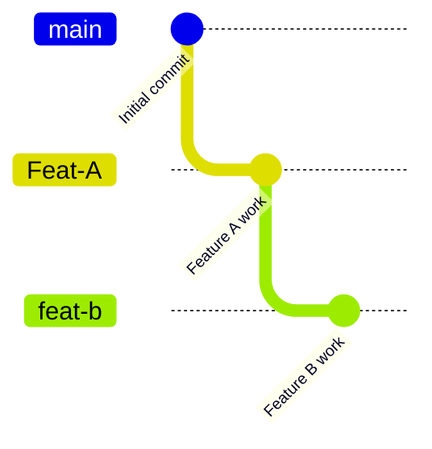
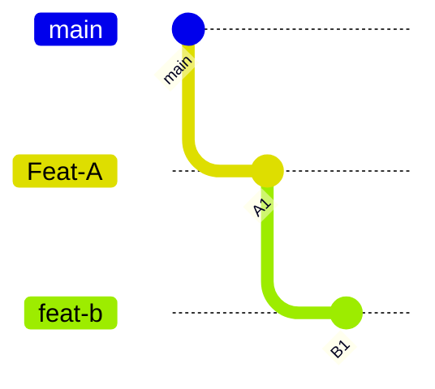
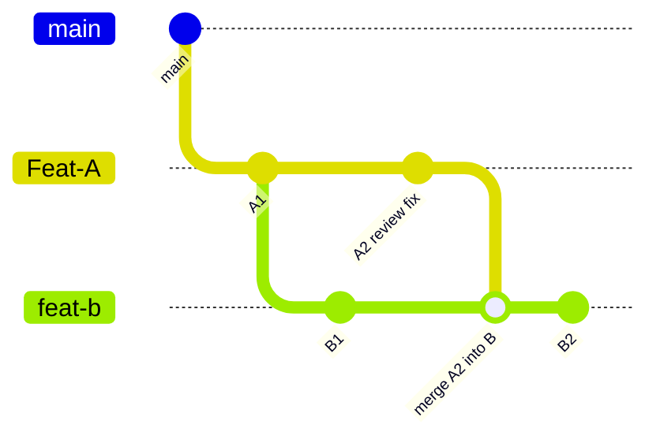
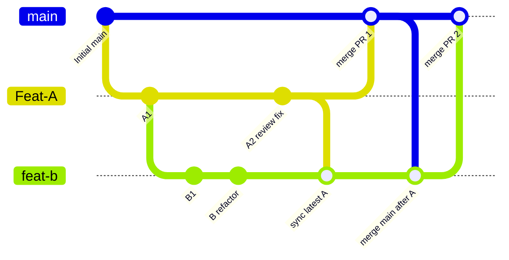
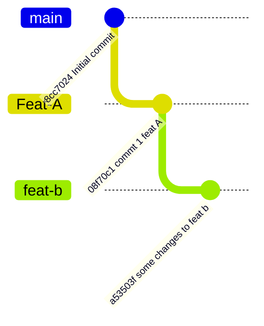

# Stacked feature branches with merge-based updates

This sandbox represents a common situation:

- `main` is the target branch.
- `Feat-A` is the first feature branch.
- `feat-b` depends on `Feat-A`.
- `Feat-A` will be merged first.
- `Feat-A` may continue receiving commits while `feat-b` already exists.
- The team prefers `git merge` over `git rebase`.
- `feat-b` may contain large refactoring changes.

The desired branch shape is:



## Pull request setup

Open two pull requests:

```text
PR 1: Feat-A => main
PR 2: feat-b => Feat-A
```

Do not open `feat-b => main` while `Feat-A` is still unmerged. If you do,
the second PR will include both `Feat-A` changes and `feat-b` changes, which
makes review harder and hides the real scope of feature B.

By targeting `feat-b` into `Feat-A`, the second PR shows only the changes that
belong to feature B.



```text
PR 1 compares Feat-A against main.
PR 2 compares feat-b against Feat-A.
```

## Creating feat-b from Feat-A

Start from the latest `Feat-A`:

```bash
git checkout Feat-A
git pull origin Feat-A
git checkout -b feat-b
git push -u origin feat-b
```

Then open:

```text
feat-b => Feat-A
```

## Keeping feat-b updated while Feat-A changes

If more commits are added to `Feat-A`, merge them into `feat-b`:

```bash
git checkout feat-b
git fetch origin
git merge origin/Feat-A
git push
```

This keeps feature B based on the current version of feature A.



Because the team prefers merge over rebase, do not use:

```bash
git rebase origin/Feat-A
git push --force-with-lease
```

The merge-based workflow uses normal pushes and preserves branch history.

## After Feat-A is merged into main

Once PR 1 is merged:

```text
Feat-A => main
```

update `feat-b` from `main`:

```bash
git checkout feat-b
git fetch origin
git merge origin/main
git push
```

Then retarget PR 2 from:

```text
feat-b => Feat-A
```

to:

```text
feat-b => main
```

At that point, `main` already contains `Feat-A`, so the PR should focus on the
remaining feature B changes.



After PR 1 is merged, PR 2 should be retargeted to `main`.

## Handling a large refactor in feat-b

Since `feat-b` may contain huge refactoring changes, keep the branch reviewable:

```text
commit 1: file moves or renames only
commit 2: update references after the moves
commit 3: apply refactoring logic
commit 4: apply behavior changes, if any
commit 5: tests or documentation cleanup
```

Avoid mixing file moves, formatting, behavior changes, and test changes in one
large commit. Smaller logical commits make the PR easier to review and make
conflicts easier to resolve.

Before starting the refactor, sync with the latest `Feat-A`:

```bash
git checkout feat-b
git fetch origin
git merge origin/Feat-A
git status
```

Only start the refactor when `git status` is clean.

## Conflict expectations

Conflicts can still happen, especially if both branches change the same files.
This workflow does not eliminate conflicts completely. It reduces surprise by
resolving conflicts earlier, while `Feat-A` is still under review.

If a conflict appears when merging `origin/Feat-A` into `feat-b`, resolve it in
`feat-b`. That resolution belongs to feature B because it is adapting B to the
latest version of A.

## Current sandbox status

At the time this note was created, the local branch graph was:



With commits:

```text
main    8cc7024 Initial commit
Feat-A  08f70c1 commt 1 feat A
feat-b  a53503f some changes to feat b
```

The recommended PRs for this sandbox are:

```text
Feat-A => main
feat-b => Feat-A
```
